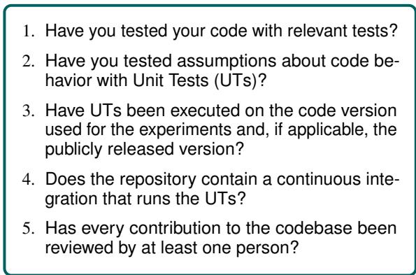
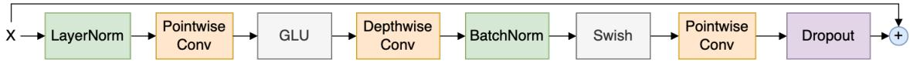

# When Good and Reproducible Results are a Giant with Feet of Clay: The Importance of Software Quality in NLP

Sara Papi , Marco Gaido , Andrea Pilzer , Matteo Negri

Fondazione Bruno Kessler

University of Trento

NVIDIA

{spapi,mgaido,negri}@fbk.eu,apilzer@nvidia.com

## Abstract

Despite its crucial role in research experiments, code correctness is often presumed solely based on the perceived quality of results. This assumption, however, comes with the risk of erroneous outcomes and, in turn, potentially misleading findings. To mitigate this risk, we posit that the current focus on reproducibility should go hand in hand with the emphasis on software quality. We support our arguments with a case study in which we identify and fix three bugs in widely used implementations of the state-ofthe-art Conformer architecture. Through experiments on speech recognition and translation in various languages, we demonstrate that the presence of bugs does not prevent the achievement of good and reproducible results, which however can lead to incorrect conclusions that potentially misguide future research. As countermeasures, we release pangoliNN, a library dedicated to testing neural models, and propose a Code-quality Checklist, with the goal of promoting coding best practices and improving software quality within the NLP community.

## 1 Introduction

In the field of natural language processing (NLP), as well as in broader contexts, the validity and soundness of research findings are typically upheld by “establishing consistency of results versus existing implementations, standard benchmarks, or sanity checks via statistically significant experimental results” (Rozier and Rozier, 2014). Embracing these recommendations as the exclusive criteria for validating scientific credibility, the research community has recently devoted significant attention to the reproducibility (Dodge et al., 2019; Branco et al., 2020; Belz et al., 2021b; Belz, 2022; The Turing Way Community, 2022) and the soundness of experimental settings and comparisons (Denkowski and Neubig, 2017; Dror et al., 2018; Marie et al., 2021). Specifically, in response to evidence indicating the absence of these aspects in many research papers (Raff, 2019) and to mitigate the so-called “reproducibility crisis” (Baker, 2016),1 top-tier conferences have introduced dedicated checklists and targeted questions in the reviewing forms (Pineau et al., 2021; Rogers et al., 2021).

However, a fundamental question remains regarding the initial assumption: are reproducibility and thorough evaluation against robust baselines sufficient to ensure the soundness of a research finding? According to Peng (2011), reproducibility alone does not “guarantee the quality, correctness, or validity of the published results” since the code employed to produce them may not accurately execute its intended purpose. This entails inherent risks, as flawed code that produces good and easily reproducible results can propagate as the foundation for further research, ultimately leading to further unreliable and potentially misleading findings (McCullough et al., 2008).

Expanding on these observations, this paper is a call to action, underpinned by empirical evidence, to bolster the dependability of NLP findings by complementing current initiatives toward reproducibility and experimental soundness with equal emphasis on software quality. To this end, we adopt as a reference framework the principles of software quality assurance (SQA – Buckley and Poston 1984; Tripathy and Naik 2011), which have so far been overlooked by our community. Building on this foundation, we contribute as follows:

1. We examine the extent to which research works consider the attributes studied in the SQA field (§2), highlighting that code correctness has been neglected by the NLP community thus far (§3);

2. Through a case study on open-source implementations of the widespread Conformer architecture (Gulati et al., 2020), we show that:

\- At least one impactful bug is present in all the analyzed implementations (§4.1);

\- Such bugs do not prevent from achieving good and reproducible results that outperform other architectures in speech recognition and translation across different language pairs (§4.3);

\- Undetected bugs can lead to erroneous conclusions when evaluating new techniques (§4.4).

3. We release a bug-free implementation of Conformer,2 along with all the pre-trained models;

4. We promote code correctness and software quality by releasing pangoliNN,3 a library featuring easily-usable unit tests to enforce the proper behavior of neural models (§5.1), and proposing the integration into current conferences checklists of a Code-quality section, which would focus on coding best practices (§5.2).

## 2 SQA and Research

Software Quality Assurance (SQA) attributes have been studied for many years (McCall et al., 1977; Deutsch and Willis, 1988; Glass, 1992). Delineated in the ISO 9126 standard (ISO/IEC, 2001), they were later extended and superseded by ISO 25010 (ISO/IEC, 2010), having production code as the main target. However, as they are desirable for any codebase, here we analyze how each attribute has an effect on research code and work.

Portability and usability refer, respectively, to the possibility of executing the same experiments in diverse hardware or software environments, and the effort required to use the software (i.e., how easy it is to run the code). As such, they pertain to the reproducibility of a paper, which, according to ACM,4 holds when “an independent group can obtain the same result using the author’s own artifacts”, a definition that is aligned with those given in NLP (Ulmer et al., 2022) and other fields (Schloss, 2018). Regarding these aspects, ample literature already discussed the need to go beyond code openness in research (Chen et al., 2019; Trisovic et al., 2022), highlighting the role of proper documentation and validation in different environments. However, as many research groups lack access to a wide range of hardware options, we argue that research works can hardly target portability due to the significant economic and human resources it requires. On the contrary, proper documentation of the code is a reasonable demand and, in addition to increasing reproducibility, it facilitates code reuse and adoption for other works.

Code reusability also pertains to the maintainability attribute, which denotes the effort required for implementing targeted modifications. Alongside comprehensive documentation, software maintainability hinges on code structure, i.e. the organization of the software into building blocks (Perry and Wolf, 1992; Garlan and Shaw, 1993). While there is currently no incentive to develop reusable code (Barba, 2019), the research community would greatly benefit in the long term from a commitment to this objective, which would reduce the time spent in replicating prior work and accelerate the implementation of new techniques upon existing code.

The expeditiousness of testing new methods also depends on the efficiency and reliability of the codebase. Efficiency refers to the amount of resources a software uses, e.g. the number of GPU hours or VRAM GBs needed for training. Increasing efficiency constitutes a research direction on its own and can hardly be considered a prerequisite for orthogonal investigations. Reliability, instead, is the capability of the software to seamlessly operate in all conditions and for a long time: software causing frequent crashes (i.e. terminations due to errors) or whose efficiency is not constant over time is not reliable. Although both properties would contribute to reducing the environmental footprint of NLP research by avoiding computing-resource wastes or unexpected failures (Strubell et al., 2019; Shterionov and Vanmassenhove, 2023), a commitment in this direction is arguably an excessive demand for research works not expressly dedicated to it.

Last but not least, functionality or functional correctness (hereinafter: correctness) pertains to the “extent to which a program satisfies its specifications” (McCall et al., 1977). In research, this holds when the code exactly performs the operations described in a paper, thereby establishing the validity of the reported findings. Achieving correctness requires the creation and execution of tests, as they are the sole mechanism that guarantees the correct behavior of software. For example, when designing a causal model (i.e. a model that cannot look at future elements in the input sequence), researchers should test that the model predictions always remain unaffected by future elements. If a bug breaks the causality property, any observed gains may not stem from the proposed solutions but from undue access to forbidden information. It is worth emphasizing that the validity of these tests expires after any code alteration, regardless of its apparent relevance. Therefore, tests should be executed after each modification to ensure correctness and, in turn, the trustworthiness of the findings.

In summary, we have observed that, in the context of research software, i) portability and usability support reproducibility, ii) maintainability promotes reusability, iii) efficiency and reliability reduce environmental costs, and iv) correctness plays a crucial role in ensuring trustworthy findings and research soundness. However, despite its importance, we show in the next section that the research community has largely neglected correctness, focusing primarily on reproducibility.

## 3 Research Code Quality Evaluation

To assess the level of consideration given to the above SQA attributes within the NLP research community, we examined their inclusion in the review forms of top-tier conferences and journals in the field, namely: \*ACL (i.e., AACL-IJCNLP, ACL, EACL, EMNLP, NAACL),5 ACL Rolling Review (ARR), ICASSP, ICML, ICLR, Interspeech, NeurIPS, and TACL. We specifically focused on reproducibility (as a proxy of portability and usability) and correctness. Table 1 shows the results.

Most of the venues (5 out of 8) include an explicit score for reproducibility and NeurIPS mentions it among the factors contributing to the overall recommendation score. Reproducibility is commonly evaluated through dedicated checklists6 that mainly focus on the detailed descriptions of the hyperparameters and the software/hardware environment (while disregarding whether different hardware/software is supported, i.e. portability, which seems reasonable as seen in §2). Accordingly, these checklists are not strictly related to SQA, although they do include recommendations for proper code documentation, which is related to the software usability and maintainability.

<table><tr><td>Venue</td><td>Reproducibility</td><td>Correctness</td></tr><tr><td>*ACL</td><td>V</td><td>X</td></tr><tr><td>ARR</td><td>V</td><td>X</td></tr><tr><td>ICASSP</td><td>X</td><td>V</td></tr><tr><td>ICML</td><td>X</td><td>X</td></tr><tr><td>ICLR</td><td>V</td><td>V</td></tr><tr><td>Interspeech</td><td>V</td><td>X</td></tr><tr><td>NeurIPS</td><td>X</td><td>X</td></tr><tr><td>TACL</td><td>V</td><td>V</td></tr></table>

Table 1: Reproducibility and correctness in the review forms of major NLP conferences/journals.

Correctness is instead mentioned in fewer forms (3 out of 8). When present, its definition varies and is not explicitly related to the code: at ICLR and ICASSP, the scope of the term is not clearly defined, while in TACL it is included in the broader concept of soundness of the experiments/results. In this result-oriented definition, soundness pertains to assessing the significance of results (are the reported improvements robust to statisticalfluctuations?) with respect to either the state of the art (are the results competitive with those reported in recent literature?) or strong baselines. Soundness is also assessed at NeurIPS and ICML but, again, code correctness is never explicitly mentioned. Notably, the Interspeech form contains a “Technical Correctness” score, which however refers to the reproducibility of the paper (“are enough details provided to be able to reproduce the experiments?”). In general, when considered, software is explicitly evaluated only in terms of accessibility (is the code released open-source?) and potential usefulness (will the research community benefitfrom the use of the software?). For instance, the “Software” score in the ARR form only refers to the usefulness and documentation of newly-released code rather than to its correctness, thus being again more related to its usability and maintainability.

We can conclude that, unlike reproducibilityrelated SQA attributes, correctness is largely neglected in favor of a result-based evaluation of soundness. From the researchers’ perspective, this entails the risk of basing future work on unreliable software that yields high and easily reproducible results but lacks guarantees of its correctness. This risk, in turn, can lead to misleading findings (Mc-Cullough et al., 2008). In the next section, we present a concrete instance of this problem with a case study analyzing open-source implementations of the widespread Conformer architecture.

## 4 The Case Study

In our case study, we examine the Conformer (Gulati et al., 2020) architecture – the state-of-the-art solution for speech processing tasks (Guo et al., 2021; Ma et al., 2021; Srivastava et al., 2022; Li and Doddipatla, 2023) such as automatic speech recognition (ASR) and speech-to-text translation (ST) – whose rapid and wide adoption is evidenced by more than 2,000 citations since 2020.7

In the following, we first analyze the Conformer implementation of six widely-used open-source codebases, showing that they all contain at least one bug (§4.1). Then, through extensive experiments on the two tasks and on eight language pairs, we demonstrate that the presence of bugs can be hidden by good – but incorrect – results (§4.3), consequently leading to erroneous conclusions (§4.4). An introduction of the ASR and ST tasks object of our study, along with an overview of the Conformer architecture is provided in Appendix A.

## 4.1 Analysis of the Codebases

We analyze the behavior of the open-source implementations of the Conformer by systematically varying a parameter that should not affect the results: the inference batch size (IBS). With high IBSs, many samples are collected in the same batch, allowing for their parallel processing on GPU to reduce the overall computational cost. When samples of different lengths are collected in the same batch – a frequent situation in speech tasks, where the input length largely varies – the input sequences are brought to the same dimension by filling them with padding. Since with correct implementations the results are independent of the presence of padding (and, therefore, of the IBS), research papers usually include only the training batch size (which, instead, is an important hyperparameter for the stability of the training). However, as we demonstrate in this section, the bugs present in the Conformer implementations undermine the above assumption.

We studied six widely-used repositories, namely: Fairseq-ST (Wang et al., 2020), ESPnet-ST (Inaguma et al., 2020), NeMo (Kuchaiev et al., 2019), SpeechBrain (Ravanelli et al., 2021), an open source codebase named “Conformer”,8 and TorchAudio (Yang et al., 2021). We discovered that all these implementations return different results with different IBSs, showing that the presence of padding incorrectly alters the results.9 Upon inspection of the codes, we isolated three bugs associated with padding handling in: Conformer Convolutions $( \aleph _ { 1 } )$ , Initial Subsampling $( \aleph _ { 2 } )$ , and Positional Encodings $( \ P _ { 3 } )$

<table><tr><td rowspan=1 colspan=1>P0o</td><td rowspan=1 colspan=1>P01</td><td rowspan=1 colspan=1>P02</td><td rowspan=1 colspan=1>0</td><td rowspan=1 colspan=1>0</td></tr><tr><td rowspan=1 colspan=1>P10</td><td rowspan=1 colspan=1>P11</td><td rowspan=1 colspan=1>P12</td><td rowspan=1 colspan=1>0</td><td rowspan=1 colspan=1>0</td></tr><tr><td rowspan=1 colspan=1>P20</td><td rowspan=1 colspan=1>P21</td><td rowspan=1 colspan=1>P22</td><td rowspan=1 colspan=1>0</td><td rowspan=1 colspan=1>0</td></tr><tr><td rowspan=1 colspan=1>0</td><td rowspan=1 colspan=1>0</td><td rowspan=1 colspan=1>0</td><td rowspan=1 colspan=1>0</td><td rowspan=1 colspan=1>0</td></tr><tr><td rowspan=1 colspan=1>0</td><td rowspan=1 colspan=1>0</td><td rowspan=1 colspan=1>0</td><td rowspan=1 colspan=1>0</td><td rowspan=1 colspan=1>0</td></tr></table>

(1) Before shifting, the Relative PE matrix $( P _ { 0 0 } , . . . , P _ { 2 2 } )$ is padded (zero values).
<table><tr><td rowspan=1 colspan=1>0</td><td rowspan=1 colspan=1>P00</td><td rowspan=1 colspan=1>P01</td><td rowspan=1 colspan=1>P02</td><td rowspan=1 colspan=1>0</td></tr><tr><td rowspan=1 colspan=1>0</td><td rowspan=1 colspan=1>0</td><td rowspan=1 colspan=1>P10</td><td rowspan=1 colspan=1>P11</td><td rowspan=1 colspan=1>P12</td></tr><tr><td rowspan=1 colspan=1>0</td><td rowspan=1 colspan=1>0</td><td rowspan=1 colspan=1>0</td><td rowspan=1 colspan=1>P20</td><td rowspan=1 colspan=1>P21</td></tr><tr><td rowspan=1 colspan=1>P22</td><td rowspan=1 colspan=1>0</td><td rowspan=1 colspan=1>0</td><td rowspan=1 colspan=1>0</td><td rowspan=1 colspan=1>0</td></tr><tr><td rowspan=1 colspan=1>0</td><td rowspan=1 colspan=1>0</td><td rowspan=1 colspan=1>0</td><td rowspan=1 colspan=1>0</td><td rowspan=1 colspan=1>0</td></tr><tr><td rowspan=1 colspan=1>0</td><td rowspan=1 colspan=1>0</td><td rowspan=1 colspan=1>0</td><td rowspan=1 colspan=1>0</td><td rowspan=1 colspan=1>0</td></tr></table>

(2) When relative shift is applied to the Relative PE matrix without considering padding, some values of the padding area (in red) are incorrectly moved to the non-padding area.
<table><tr><td rowspan=1 colspan=1>0</td><td rowspan=1 colspan=1>P00</td><td rowspan=1 colspan=1>P01</td><td rowspan=1 colspan=1>0</td><td rowspan=1 colspan=1>0</td></tr><tr><td rowspan=1 colspan=1>P02</td><td rowspan=1 colspan=1>0</td><td rowspan=1 colspan=1>P10</td><td rowspan=1 colspan=1>0</td><td rowspan=1 colspan=1>0</td></tr><tr><td rowspan=1 colspan=1>P11</td><td rowspan=1 colspan=1>P12</td><td rowspan=1 colspan=1>0</td><td rowspan=1 colspan=1>0</td><td rowspan=1 colspan=1>0</td></tr><tr><td rowspan=1 colspan=1>P20</td><td rowspan=1 colspan=1>P21</td><td rowspan=1 colspan=1>P22</td><td rowspan=1 colspan=1>0</td><td rowspan=1 colspan=1>0</td></tr><tr><td rowspan=1 colspan=1>0</td><td rowspan=1 colspan=1>0</td><td rowspan=1 colspan=1>0</td><td rowspan=1 colspan=1>0</td><td rowspan=1 colspan=1>0</td></tr><tr><td rowspan=1 colspan=1>0</td><td rowspan=1 colspan=1>0</td><td rowspan=1 colspan=1>0</td><td rowspan=1 colspan=1>0</td><td rowspan=1 colspan=1>0</td></tr></table>

(3) When relative shift is applied to the Relative PE matrix considering padding, the values $P _ { 0 0 } , . . . , P _ { 2 2 }$ are not moved to the padding area.  
Figure 1: Example of relative shift operation starting from a Relative PE matrix containing padding (1), both considering a codebase with $\Re _ { 3 } \left( 2 \right)$ and without (3) bug. The first row is always discarded.

Conformer Convolutions $( \widetilde { \pi } _ { 1 } )$ The depthwise and pointwise convolutions of the Conformer convolution module do not consider the presence of padding and produce a non-padded output with nonzero values adjacent to the input sample. These values modify the behavior of the subsequent batch normalization and of the other convolutions, leading to incorrect alterations of the valid values.

<table><tr><td>Repository</td><td>Conv. Mod.</td><td>SubSampl.</td><td>Pos. Enc.</td></tr><tr><td>Fairseq-ST</td><td>0</td><td>02</td><td>…</td></tr><tr><td>ESPnet-ST</td><td>…</td><td>0 2</td><td>3</td></tr><tr><td>NeMo</td><td></td><td>0</td><td>3</td></tr><tr><td>SpeechBrain</td><td></td><td>0</td><td>I 3</td></tr><tr><td>Conformer</td><td></td><td></td><td></td></tr><tr><td>TorchAudio</td><td></td><td> $\mathrm { N A }$ </td><td> $\mathrm { N A }$ </td></tr></table>

Table 2: Bugs present in the analyzed repositories. NA stands for “Not Applicable”.

Initial Subsampling $( \phantom { } ^ { \sharp } \vec { \pi } _ { 2 } )$ The two initial convolutions that subsample the input sequence by a factor of 4 do not consider padding. Hence, the second convolution is fed with non-zero values adjacent to the input sequence, which are wrongly considered in the computation of the last valid elements.

Positional Encodings $( \Re _ { 3 } )$ The relative sinusoidal positional encodings (PEs), which are added to the attention matrix, are computed by shifting a sinusoidal matrix. This shifting operation first prepends a zero column to the sinusoidal matrix and then reshapes it so that the last element of the first row becomes the first element of the second row, the last two elements of the second row become the first ones of the third row, and so on. By doing this, this operation assumes that all elements are valid. However, when a sequence is padded, only part of the attention matrix is valid (in green in Figure 1.1) and spurious values are moved to the beginning of the next row (Figure 1.2). In Figure 1, for the sake of clarity of the example, we set to 0 the PE in the padding area. While this is not what happens in practice (as the padding area contains other sinusoidal PEs), it shows that the correct values are discarded and the final matrix significantly differs from the one obtained without padding, which is instead shown in Figure 1.3.

In Table 2, we report the presence (or absence) of these bugs for each analyzed codebase in its current version. All the implementations but one (NeMo) are affected by ${ \mathbb { \ R } } _ { 1 }$ . Also, all are affected by $\Re _ { 2 }$ and $\Re _ { 3 }$ , except for TorchAudio, whose implementation neither includes relative positional encodings in the attention nor the initial sub-sampling convolutional layers. Having ascertained that all the analyzed implementations contain at least one bug, the next sections will concentrate on their impact on ASR and ST results and, in turn, the related findings.

## 4.2 Experimental Settings

We train and evaluate ASR and ST models on MuST-C v1.0 (Cattoni et al., 2021), which contains parallel speech-to-text data with English (en) as source language and 8 target text languages, namely Dutch (nl), French (fr), German (de), Italian (it), Portuguese (pt), Romanian (ro), Russian (ru), and Spanish (es). For ASR, we use the en-es section (the largest of the corpus). For ST, 8 different models are trained, one for each language direction. Evaluation is performed on the tst-COMMON, by computing word error rate (WER) for ASR and BLEU with SacreBLEU (Post, $2 0 1 8 ) ^ { 1 0 }$ for ST. We assess statistical significance using bootstrap resampling (Koehn, 2004) with 95% confidence interval. Detailed experimental settings are reported in Appendix B.

Trainings and inferences were performed on, respectively, two and one A40 GPU(s). On Ampere GPUs, PyTorch computes convolutions and matrix multiplications with TensorFloat-3211 (TF32) tensor cores by default. TF32 speeds up the computation but introduces numeric errors that can cause small random fluctuations, e.g. in the presence of padding. In the following, we experiment both with and without TF32 (both at training and inference time) because padding has no effect on the final outputs only when TF32 is disabled.

## 4.3 Impact of the Identified Bugs

We evaluate the impact of the identified bugs (§4.1) on ASR and ST results by varying the IBSs as increasing the batch size introduces more padding, amplifying the effects of the bugs. Initially, experiments are conducted on our correct codebase ( ). Subsequently, we enable single precision (TF32). Then, we reintroduce the bugs individually $( \mathbb { \breve { N } } _ { 1 } .$ $\aleph _ { 2 }$ , and $/ ( { \binom { 3 } { 3 } } )$ , and all together $( \mathbb { M } _ { 1 , 2 , 3 } )$

ASR Table 3 shows, in comparison to , the impact of TF32 and of the different bugs on ASR performance. First, TF32 causes a not statistically significant quality drop (+0.21 WER), which does not vary with the IBS (despite the presence of minor variations in the outputs attested by a slightly different number of generated words). When the bugs are present $( \mathbb { W } _ { 1 } , \mathbb { M } _ { 2 } , \mathbb { M } _ { 3 } )$ , instead, the performance becomes sensitive to the IBS. This is particularly evident with 1, which significantly increases the error rate (+8.78 WER) when we introduce a considerable amount of padding (IBS=100). It is noteworthy that most of the differences compared to the bug-free version ( ) are not statistically significant, and the best result is achieved with and 1 as IBS. Only the presence of all bugs $\mathbb { \ R } _ { 1 , 2 , 3 }$ causes consistent and statistically significant quality drops. Nonetheless, the results with 1 and 10 as IBS are still far better than those obtained with Transformer architectures on the same benchmark (i.e. 26.61 by Cattoni et al. 2021 and 15.6 by Gaido et al. 2021). Moreover, their reproducibility is not hindered by the presence of bugs, as setting the IBS to any particular value consistently yields the same score. We can conclude that evenflawed code can produce competitive and reproducible results and, therefore, focusing only on these two aspects is not enough to ensure the trustworthiness of the code.

<table><tr><td rowspan="2">Code</td><td colspan="3">IBS</td></tr><tr><td>1</td><td>10</td><td>100</td></tr><tr><td>V</td><td>10.52</td><td>10.52</td><td>10.52</td></tr><tr><td>+ TF32</td><td>10.73</td><td>10.73</td><td>10.73</td></tr><tr><td>+1</td><td>10.72</td><td>11.25*</td><td>19.50*</td></tr><tr><td> $+  _ { 2 }$ </td><td>10.73</td><td>10.74</td><td>10.74</td></tr><tr><td>+3</td><td>10.46</td><td>10.62</td><td>10.73</td></tr><tr><td> $+ \left. \widetilde { \mathcal { V } } _ { 1 , 2 , 3 } \right.$ </td><td>11.32*</td><td>14.25*</td><td>54.56*</td></tr></table>

Table 3: WER for ASR with TF32 and bugs as IBS varies (1, 10, and 100 sentences). \* indicates that the difference with is statistically significant.

<table><tr><td></td><td colspan="2">en-de</td><td colspan="2">en-es</td></tr><tr><td rowspan="2">Code</td><td>IBS</td><td></td><td>IBS</td><td></td></tr><tr><td>1 10</td><td>100</td><td>1 10</td><td>100</td></tr><tr><td>V</td><td>24.6724.67</td><td>24.67</td><td>30.34 30.34</td><td>30.34</td></tr><tr><td>+ TF32</td><td>24.84 24.84</td><td>24.83</td><td>30.63 30.62</td><td>30.63</td></tr><tr><td> $\mathbf { \nabla } + \Re \mathbb { \vec { K } } _ { 1 }$ </td><td>24.52 24.65</td><td>24.67</td><td>29.53* 29.41*</td><td>27.71*</td></tr><tr><td>+02</td><td>24.5624.57</td><td>24.58</td><td>30.53 30.53</td><td>30.53</td></tr><tr><td> $+ \left. \widetilde { \mathcal { W } } _ { 3 } \right.$ </td><td>24.53 24.46</td><td>24.42</td><td>30.33 30.35</td><td>30.24</td></tr><tr><td>+  $\Re _ { 1 , 2 , 3 }$ </td><td>24.6824.58</td><td>23.23*</td><td>28.57* 27.81*</td><td>21.15*</td></tr></table>

Table 4: BLEU for ST with TF32 and bugs as IBS varies (1, 10, and 100 sentences). \* indicates that the difference with is statistically significant.

ST Table 4 reports the same study on the two most used sections of MuST-C (en-de, and en-es). The behavior is quite different between the two, but the best scores are always obtained with TF32 and without bugs. On en-es, $\mathbb { \ R } _ { 1 }$ causes statistically significant drops that increase with the IBS and are exacerbated if combined with the other two bugs $( \mathbb { M } _ { 1 , 2 , 3 } )$ . On en-de, instead, none of the bugs significantly impacts the results. Interestingly, the result obtained with all bugs $( \mathbb { M } _ { 1 , 2 , 3 } )$ and 1 as IBS is slightly higher (+0.01) than that without bugs ( ). Furthermore, by comparing the scores obtained with all bugs $( \mathbb { M } _ { 1 , 2 , 3 } )$ and 1 as IBS with those of previous ST works (Table 5), we can notice that, as previously observed for ASR, the presence of bugs is not evident from the results, which are still competitive with those of other models. This supports our conclusion that good (and reproducible) results do not imply code correctness, as this statement holds for different tasks and language pairs.

<table><tr><td>Model</td><td>en-de</td><td>en-es</td></tr><tr><td>ESPNet (Inaguma et al., 2020) Fairseq (Wang et al., 2020) Speechformer (Papi et al., 2021)</td><td>22.9 22.7 23.6</td><td>28.0 27.2</td></tr><tr><td>E2E + ML (Zhao et al., 2021) SATE (no KD) (Xu et al., 2021)</td><td>24.1</td><td>28.5 28.5</td></tr><tr><td>E2E-ST-FS (Zhang et al., 2022) S2T-Perceiver (Tsiamas et al., 2023)  $\overline { { \mathrm { C o n f o r m e r } \left{  { \mathbb { \oplus } } _ { 1 , 2 , 3 } ^ { \beta } }  } }\right.$ </td><td>23.0 24.2 24.7</td><td>28.0 28.0</td></tr></table>

Table 5: BLEU of models trained on MuST-C en-de and en-es compared to Conformer $\mathcal { \widetilde { W } } _ { 1 , 2 , 3 }$ (IBS=1).

## 4.4 Impact of Building on Incorrect Code

We now showcase how incorrect code can lead to misleading conclusions when experimenting with a new technique. We choose to evaluate the CTC compression (Liu et al., 2020; Gaido et al., 2021) because we speculate that it limits the negative effects of the bugs identified in §4.1, as it reduces the sequence lengths and, in turn, the amount of padding. Introduced in the context of Transformerbased models, CTC compression reduces training and inference times, as well as VRAM requirements, while yielding minimal (not statistically significant) gains in terms of translation quality (Gaido et al., 2021). A detailed description of the CTC compression is provided in Appendix C.

ASR Table 6 shows the effects on ASR performance of introducing CTC compression (CTC Compr.) into the codebase with all bugs $( \mathbb { M } _ { 1 , 2 , 3 } )$ and without them ( ). CTC compression causes a small and not statistically significant performance degradation (+0.12 WER) when the correct implementation ( ) is used (in accordance with the findings on the Transformer architecture). When bugs are present in the codebase $( \mathbb { M } _ { 1 , 2 , 3 } )$ , instead, the outcome is overturned: CTC compression brings statistically significant gains (-0.93 WER even with 1 as IBS). These observations lead to the conclusion that building on incorrect code can produce misleadingfindings. Besides, the best overall result is achieved with the $\mathbb { \ R } _ { 1 , 2 , 3 }$ codebase (with 10 as IBS and CTC compression), reiterating that high scores do not imply code correctness.

<table><tr><td rowspan=1 colspan=1>Code</td><td rowspan=1 colspan=1>Model</td><td rowspan=1 colspan=1>IBS</td><td rowspan=1 colspan=1>en-de</td><td rowspan=1 colspan=1>en-es</td><td rowspan=1 colspan=1>en-fr</td><td rowspan=1 colspan=1>en-it</td><td rowspan=1 colspan=1>en-nl</td><td rowspan=1 colspan=1>en-pt</td><td rowspan=1 colspan=1>en-ro</td><td rowspan=1 colspan=1>en-ru</td><td rowspan=1 colspan=1>Avg</td></tr><tr><td rowspan=2 colspan=1>V</td><td rowspan=1 colspan=1>Conformer</td><td rowspan=1 colspan=1>110100</td><td rowspan=1 colspan=1>24.67</td><td rowspan=1 colspan=1>30.34</td><td rowspan=1 colspan=1>36.22</td><td rowspan=1 colspan=1>25.73</td><td rowspan=1 colspan=1>30.04</td><td rowspan=1 colspan=1>30.55</td><td rowspan=1 colspan=1>23.43</td><td rowspan=1 colspan=1>17.29</td><td rowspan=1 colspan=1>27.28</td></tr><tr><td rowspan=1 colspan=1>Conformer+CTC Compr.</td><td rowspan=1 colspan=1>110100</td><td rowspan=1 colspan=1>24.97</td><td rowspan=1 colspan=1>30.48</td><td rowspan=1 colspan=1>36.43</td><td rowspan=1 colspan=1>26.25*</td><td rowspan=1 colspan=1>30.31</td><td rowspan=1 colspan=1>30.09†</td><td rowspan=1 colspan=1>24.67*</td><td rowspan=1 colspan=1>17.35</td><td rowspan=1 colspan=1>27.57</td></tr><tr><td rowspan=2 colspan=1>家1,2,3</td><td rowspan=1 colspan=1>Conformer</td><td rowspan=1 colspan=1>110100</td><td rowspan=1 colspan=1>24.6824.5823.23</td><td rowspan=1 colspan=1>28.5727.8121.15</td><td rowspan=1 colspan=1>35.7035.6531.70</td><td rowspan=1 colspan=1>25.8125.7023.42</td><td rowspan=1 colspan=1>29.6829.3524.92</td><td rowspan=1 colspan=1>30.2230.0227.72</td><td rowspan=1 colspan=1>23.5223.4322.68</td><td rowspan=1 colspan=1>15.8315.3611.05</td><td rowspan=1 colspan=1>26.7526.4923.23</td></tr><tr><td rowspan=1 colspan=1>Conformer+CTC Compr.</td><td rowspan=1 colspan=1>110100</td><td rowspan=1 colspan=1>24.9525.21*25.26*</td><td rowspan=1 colspan=1>30.49*30.72*30.52*</td><td rowspan=1 colspan=1>36.27*36.18*36.36*</td><td rowspan=1 colspan=1>25.8426.0125.88*</td><td rowspan=1 colspan=1>29.4229.6429.66*</td><td rowspan=1 colspan=1>30.0430.1430.16*</td><td rowspan=1 colspan=1>23.96*23.95*23.92*</td><td rowspan=1 colspan=1>17.05*17.06*16.87*</td><td rowspan=1 colspan=1>27.2527.3627.33</td></tr></table>

Table 7: BLEU for ST of the correct/incorrect codebase with and without CTC Compr. as IBS varies (1, 10, and 100). \*/† indicate that the improvement/degradation of CTC Compr. is statistically significant.

<table><tr><td rowspan="2">Model</td><td rowspan="2">Code</td><td colspan="3">IBS</td></tr><tr><td>1</td><td>10</td><td>100</td></tr><tr><td>Conformer</td><td>V</td><td>10.52</td><td>10.52</td><td>10.52</td></tr><tr><td rowspan="2">+ CTC Compr. Conformer</td><td rowspan="2"></td><td>10.64</td><td>10.64</td><td>10.64</td></tr><tr><td>11.32</td><td>14.25</td><td>54.56</td></tr><tr><td>+ CTC Compr.</td><td> $\Re _ { 1 , 2 , 3 }$ </td><td>10.39*</td><td>10.34*</td><td>10.81*</td></tr></table>

Table 6: WER for ASR of the correct/incorrect codebase with and without CTC Compr. as IBS varies (1, 10, and 100). \* indicates that the improvement of CTC Compr. is statistically significant.

ST Table 7 reports the same analysis on the 8 language pairs of MuST-C. As in ASR, the presence of bugs $( \sharp _ { 1 , 2 , 3 } )$ unduly rewards the CTC compression mechanism, which yields statistically significant gains on all the languages with 100 as IBS and on 4/5 out of 8 languages with 1/10 as IBS. With the bug-free version ( ), instead, the improvements are statistically significant only on two language pairs (en-it, and en-ro), while on en-pt there is a statistically significant degradation. On average over all language pairs, the gain brought by CTC compression in the presence of bugs $( \mathbb { \breve { N } } _ { 1 , 2 , 3 } )$ ranges from 0.5 BLEU (with 1 as IBS) to 4.1 BLEU (with 100 as IBS), while it is only of 0.29 BLEU with the correct code ( ). We can hence confirm that the presence ofbugs leads to erroneousfindings also in the ST task, as CTC compression seems to significantly improve translation quality, which is not the case with the correct Conformer implementation (as well as with Transformer, as proved by Gaido et al. 2021). Moreover, the best scores for en-de and en-es are achieved with the presence of all bugs $( \mathbb { N } _ { 1 , 2 , 3 } ) .$ , and the average performance gap between codebases with $( \mathbb { M } _ { 1 , 2 , 3 } )$ and without ( ) bugs can be as little as 0.21 BLEU (when IBS is 10) and may be further narrowed, or even overturned, by “tuning” the IBS. This demonstrates again the impossibility to assess code correctness only by looking at the results.

## 5 Increasing Research Code Correctness

After demonstrating that the current tendency to assess code correctness solely based on the reported results (§3) potentially leads to wrong findings (§4), in this section we propose countermeasures. Specifically, we aim at fostering the adoption of SQA best practices in two ways: 1) by releasing a Python package (pangoliNN) for testing neural networks and assisting researchers in the verification of code correctness (§5.1); 2) by proposing the integration of current conference checklists with recommendations for SQA best practices (§5.2).

## 5.1 pangoliNN

As discussed in §2, testing software is the only way to enforce that it works correctly. Therefore, as the first and foremost method to increase code correctness, we recommend the extensive implementation and adoption of Unit Tests (UTs) to check that the code has the expected behavior (Liskov, 1975; Goodenough and Gerhart, 1975; Huizinga and Kolawa, 2007; Kassab et al., 2017). Ideally, this should be done prior to writing the actual code, following the so-called “test-driven development practice” (Beck, 2002). UTs should cover all the assumptions about how the code works (e.g., ensuring that the presence of padding does not alter the results). While achieving complete test coverage is a utopian objective, the higher the coverage, the higher the quality of the codebase.

To ease this work, we introduce pangoliNN,12 a Python package specifically designed for testing neural modules. Built upon the widely used PyTorch library (Paszke et al., 2019), pangoliNN offers a collection of pre-defined tests that enforce specific behaviors of the modules.13 Its primary objective is to simplify and expedite the process of testing neural networks, alleviating researchers from the burden of creating UTs from scratch. Indeed, writing UTs may initially be perceived as an additional and undesirable cost, although ample literature dispels this perception. Williams et al. (2003), for instance, proved that the inclusion of UTs does not hamper code-writing productivity, Ellims et al. (2004, 2006) showed that the perceived cost is “exaggerated”, and Hevery (2009) that the initial overhead14 pays off by saving time spent on manual experiments.

Furthermore, unlike manual experiments that are often resource-intensive and environmentally impactful (Strubell et al., 2019), UTs are generally lightweight (e.g., they do not involve any training phase). As such, writing UTs would contribute to the environmental sustainability of NLP research, facilitating the transition to Green AI (Schwartz et al., 2020). Also, UTs do not require any pretrained model to run, as their nature and goal greatly differ from assessing the quality of a trained model, as recently proposed with behavioral testing (Ribeiro et al., 2020). Through behavioral testing, we check whether a specific instance properly handles different aspects, such as linguistic phenomena (e.g., negation, co-references), and/or produces correct outputs with challenging inputs. Through UTs, instead, we assess the behavior and robustness of the code itself (rather than of model instances), by verifying whether assumptions about properties of the network or about its behavior in specific conditions (e.g., not being influenced by the presence of padding) are respected.

Currently, pangoliNN includes tests for two aspects: i) proper handling of padding and batching, ensuring consistent output of neural modules irrespective of padding presence; and ii) addressing causality by verifying the independence of module output from future elements in the input sequence, which is crucial for autoregressive and other sequence-to-sequence models. It also features comprehensive documentation13 with simple examples to guide researchers in its usage. Moreover, pangoliNN itself is extensively unit tested, and these UTs provide additional implicit guidance on how to effectively utilize the package.

Despite being in its initial stage (for the limited number of tests currently covered), we argue that the first release of pangoliNN represents a milestone toward increasing the quality and trustworthiness of NLP research code and, in turn, outcomes. We hope that it will be embraced and expanded upon by the research community, with the integration of additional tests, ultimately growing it into a comprehensive testing library for neural networks.

## 5.2 Code-quality Checklist

As a complementary initiative, we also propose to integrate the existing conference checklists with questions targeting the improvement of code correctness and quality in research (Table 8). It is worth mentioning that we have strictly adhered to these guidelines throughout the development of both pangoliNN and of our padding-safe implementation of the Conformer architecture.

The first questions (Q1-2) focus on the adoption of UTs (possibly leveraging pangoliNN), whose importance has been stressed in the previous section. However, the presence of UTs alone does not guarantee that the code works. Indeed, UTs should be executed every time the codebase is modified, even in case of a seemingly unrelated change, as the validity of a test expires whenever the software is edited (as seen in §2). This is commonly enforced through continuous integration (CI), which executes all UTs at every code change (Duvall et al., 2007). A running and successful CI offers the supplementary advantage of providing implicit guidance on the installation and execution of the code for individuals attempting to replicate a study. Furthermore, it mitigates the occurrence of replication failures due to syntax or runtime errors, as it often happens in current NLP artifacts (Arvan et al., 2022). Such failures can arise because the released version of the code might slightly differ from those used for the experiments due to small refactorings prior to the release. For this reason, Q3 and Q4 respectively focus on test execution and on the presence of a CI, so as to ensure that the checks of the UTs are actually respected.

Lastly, we encourage (Q5) the adoption of a code reviewing practice (Baum et al., 2016), in which all changes are reviewed and approved by a person different from the code author.15 Code review is a lightweight and informal process compared to code inspection (Fagan, 1976) and has been shown to cause little overhead for most code changes (Sadowski et al., 2018). It consists in reading and commenting on the source code for a change, which should be kept small and focused on one single aspect or new feature. This aims not only at avoiding bugs, but also at improving code readability and documentation (Baum et al., 2017; Chen et al., 2019; Bahaidarah et al., 2022; Trisovic et al., 2022), and, in turn, reusability and reproducibility. In addition, it serves as a powerful tool for knowledge transfer (Bacchelli and Bird, 2013), thus novices would particularly benefit from it.

  
Table 8: Code-quality Checklist.

As a final note, we would like to emphasize that our proposed “Code-quality Checklist” should be interpreted as the “Reproducibility Checklist” now required by many top-tier venues: though strongly encouraged, following the checklist is not mandatory for paper submissions and its intent is fostering software quality and correctness rather than certifying it. Specifically, it will encourage awareness of SQA concepts and coding best practices, especially among researchers who have not been exposed to them during their education.

## 6 Conclusions

In parallel with the current efforts to enhance the reproducibility of NLP research, this paper urges similar actions targeting the improvement of research software quality, underscoring its importance for the reliability of research findings. In comparison to the attention given to reproducibility within our community, we observed the predominant neglect of code correctness and elaborated on the risks associated with assessing soundness solely on the basis of experimental results. As we empirically demonstrated through a case study involving the widespread Conformer architecture, such risks include the potential of drawing misleading conclusions from positive results obtained using flawed code. As a countermeasure, besides releasing a corrected Conformer implementation, we created the pangoliNN Python package to facilitate testing neural models and proposed the adoption of a “Code-quality Checklist” aimed at fostering coding best practices. While we acknowledge that these solutions are not a panacea, their purpose is to raise awareness within the NLP community about the importance of software quality. We hope that our endeavor will inspire a collective commitment to developing high-quality and reliable code.

## Acknowledgements

We acknowledge the support of the PNRR project FAIR - Future AI Research (PE00000013), under the NRRP MUR program funded by the NextGenerationEU. We acknowledge the CINECA award under the ISCRA initiative, for the availability of high-performance computing resources and support.

## Limitations

To back up our call to action toward the adoption of coding best practices aimed at fostering correctness and improving the quality of the developed software, we presented a case study involving the use of the Conformer architecture in the two most popular speech processing tasks: speech recognition and translation. Although the effects of the presence of bugs might be found also in other scenarios, such as text-to-speech, speech emotion recognition, spoken language understanding, and speech separation, we did not cover them in this paper. While the undesired effect of the bugs we isolated (and corrected) was empirically demonstrated, extending the analysis to other research areas would be a natural extension of our study, which could provide a more comprehensive understanding of the impact of the identified bugs on the broader NLP community working on speech-related tasks.

Moreover, in our case study, we examined the open-source implementations of Conformer, in which we identified three types of bugs related to the Convolution Module, Initial Subsampling, and Positional Encodings. While we found efficient solutions for the first two bugs, for the last one our fix introduces a significant overhead. As a result, the implementation we release, although correct, increases the training time of the models. We are confident that, by open-sourcing our code, the community will soon find a way to optimize it and overcome this limitation, capitalizing on our findings and spreading the use of more reliable versions of a state-of-the-art architecture.

## References

Mohammad Arvan, Luís Pina, and Natalie Parde. 2022. Reproducibility in computational linguistics: Is source code enough? In Proceedings of the 2022 Conference on Empirical Methods in Natural Language Processing, pages 2350–2361, Abu Dhabi, United Arab Emirates.

Alberto Bacchelli and Christian Bird. 2013. Expectations, outcomes, and challenges of modern code review. In Proceedings of the 2013 International Conference on Software Engineering, ICSE ’13, page 712–721. IEEE Press.

Layan Bahaidarah, Ethan Hung, Andreas F. De Melo Oliveira, Jyotsna Penumaka, Lukas Rosario, and Ana Trisovic. 2022. Toward reusable science with readable code and reproducibility. In 2022 IEEE 18th International Conference on e-Science (e-Science), pages 437–439, Los Alamitos, CA, USA.

Monya Baker. 2016. 1,500 scientists lift the lid on reproducibility. Nature, 533(7604):452–454.

Lorena A. Barba. 2019. Praxis of reproducible computational science. Computing in Science & Engineering, 21(1):73–78.

Tobias Baum, Hendrik Leßmann, and Kurt Schneider. 2017. The Choice of Code Review Process: A Survey on the State of the Practice. In Product-Focused Software Process Improvement, pages 111–127, Cham. Springer International Publishing.

Tobias Baum, Olga Liskin, Kai Niklas, and Kurt Schneider. 2016. A faceted classification scheme for change-based industrial code review processes. In 2016 IEEE International Conference on Software Quality, Reliability and Security (QRS), pages 74–85.

Kent Beck. 2002. Test Driven Development. By Example (Addison-Wesley Signature). Addison-Wesley Longman, Amsterdam.

Anya Belz. 2022. A Metrological Perspective on Reproducibility in NLP. Computational Linguistics, 48(4):1125–1135.

Anya Belz, Shubham Agarwal, Anastasia Shimorina, and Ehud Reiter. 2021a. A systematic review of reproducibility research in natural language processing. In Proceedings of the 16th Conference of the European Chapter ofthe Associationfor Computational Linguistics: Main Volume, pages 381–393, Online. Association for Computational Linguistics.

Anya Belz, Maja Popovic, and Simon Mille. 2022. Quantified reproducibility assessment of NLP results. In Proceedings of the 60th Annual Meeting of the Associationfor Computational Linguistics (Volume 1: Long Papers), pages 16–28, Dublin, Ireland.

Anya Belz, Anastasia Shimorina, Shubham Agarwal, and Ehud Reiter. 2021b. The ReproGen shared task on reproducibility of human evaluations in NLG: Overview and results. In Proceedings of the 14th International Conference on Natural Language Generation, pages 249–258, Aberdeen, Scotland, UK. Association for Computational Linguistics.

Anya Belz, Craig Thomson, Ehud Reiter, and Simon Mille. 2023. Non-Repeatable Experiments and Non-Reproducible Results: The Reproducibility Crisis in Human Evaluation in NLP. In Findings of the Associationfor Computational Linguistics: ACL 2023, pages 3676–3687, Toronto, Canada. Association for Computational Linguistics.

Alexandre Bérard, Olivier Pietquin, Christophe Servan, and Laurent Besacier. 2016. Listen and Translate: A Proof of Concept for End-to-End Speech-to-Text Translation. In NIPS Workshop on end-to-end learning for speech and audio processing, Barcelona, Spain.

António Branco, Nicoletta Calzolari, Piek Vossen, Gertjan Van Noord, Dieter van Uytvanck, João Silva, Luís Gomes, André Moreira, and Willem Elbers. 2020. A Shared Task of a New, Collaborative Type to Foster Reproducibility: A First Exercise in the Area of Language Science and Technology with RE-PROLANG2020. In Proceedings of the Twelfth Language Resources and Evaluation Conference, pages 5539–5545, Marseille, France. European Language Resources Association.

Fletcher J. Buckley and Robert Poston. 1984. Software quality assurance. IEEE Transactions on Software Engineering, SE-10(1):36–41.

Roldano Cattoni, Mattia Antonino Di Gangi, Luisa Bentivogli, Matteo Negri, and Marco Turchi. 2021. Mustc: A multilingual corpus for end-to-end speech translation. Computer Speech & Language, 66:101155.

Xiaoli Chen, Sünje Dallmeier-Tiessen, Robin Dasler, Sebastian Feger, Pamfilos Fokianos, Jose Benito Gonzalez, Harri Hirvonsalo, Dinos Kousidis, Artemis Lavasa, Salvatore Mele, Diego Rodriguez Rodriguez, Tibor Šimko, Tim Smith, Ana Trisovic, Anna Trzcinska, Ioannis Tsanaktsidis, Markus Zimmermann, Kyle Cranmer, Lukas Heinrich, Gordon Watts,

Michael Hildreth, Lara Lloret Iglesias, Kati Lassila-Perini, and Sebastian Neubert. 2019. Open is not enough. Nature Physics, 15(2):113–119.

Jan Chorowski, Dzmitry Bahdanau, Kyunghyun Cho, and Yoshua Bengio. 2014. End-to-end continuous speech recognition using attention-based recurrent nn: First results. In NIPS 2014 Workshop on Deep Learning, December 2014.

Zihang Dai, Zhilin Yang, Yiming Yang, Jaime Carbonell, Quoc Le, and Ruslan Salakhutdinov. 2019. Transformer-XL: Attentive language models beyond a fixed-length context. In Proceedings of the 57th Annual Meeting of the Association for Computational Linguistics, pages 2978–2988, Florence, Italy. Association for Computational Linguistics.

Yann N. Dauphin, Angela Fan, Michael Auli, and David Grangier. 2017. Language modeling with gated convolutional networks. In Proceedings of the 34th International Conference on Machine Learning - Volume 70, ICML’17, page 933–941. JMLR.org.

Michael Denkowski and Graham Neubig. 2017. Stronger baselines for trustable results in neural machine translation. In Proceedings of the First Workshop on Neural Machine Translation, pages 18–27, Vancouver. Association for Computational Linguistics.

Michael S. Deutsch and Ronald R. Willis. 1988. Software Quality Engineering: A Total Technical and Management Approach. Prentice-Hall, Inc., USA.

Mattia A. Di Gangi, Marco Gaido, Matteo Negri, and Marco Turchi. 2020. On target segmentation for direct speech translation. In Proceedings of the 14th Conference ofthe Associationfor Machine Translation in the Americas (Volume 1: Research Track), pages 137–150, Virtual. Association for Machine Translation in the Americas.

Mattia A. Di Gangi, Matteo Negri, and Marco Turchi. 2019. Adapting Transformer to End-to-End Spoken Language Translation. In Proc. Interspeech 2019, pages 1133–1137.

Jesse Dodge, Suchin Gururangan, Dallas Card, Roy Schwartz, and Noah A. Smith. 2019. Show your work: Improved reporting of experimental results. In Proceedings of the 2019 Conference on Empirical Methods in Natural Language Processing and the 9th International Joint Conference on Natural Language Processing (EMNLP-IJCNLP), pages 2185– 2194, Hong Kong, China. Association for Computational Linguistics.

Linhao Dong, Shuang Xu, and Bo Xu. 2018. Speechtransformer: A no-recurrence sequence-to-sequence model for speech recognition. In 2018 IEEE International Conference on Acoustics, Speech and Signal Processing (ICASSP), pages 5884–5888.

Rotem Dror, Gili Baumer, Segev Shlomov, and Roi Reichart. 2018. The hitchhiker’s guide to testing statistical significance in natural language processing. In Proceedings of the 56th Annual Meeting of the Associationfor Computational Linguistics (Volume 1: Long Papers), pages 1383–1392, Melbourne, Australia. Association for Computational Linguistics.

Paul M. Duvall, Steve Matyas, and Andrew Glovert. 2007. Continuous Integration: Improving Software Quality and Reducing Risk. Addison-Wesley Professional.

Michael Ellims, James Bridges, and Darrel C. Ince. 2004. Unit testing in practice. In Proceedings ofthe 15th International Symposium on Software Reliability Engineering (ISSRE?04). IEEE.

Michael Ellims, James Bridges, and Darrel C. Ince. 2006. The economics of unit testing. Empirical Software Engineering, 11(1):5–31.

M. E. Fagan. 1976. Design and code inspections to reduce errors in program development. IBM Systems Journal, 15(3):182–211.

Marco Gaido, Mauro Cettolo, Matteo Negri, and Marco Turchi. 2021. CTC-based compression for direct speech translation. In Proceedings of the 16th Conference ofthe European Chapter ofthe Association for Computational Linguistics: Main Volume, pages 690–696, Online.

Marco Gaido, Sara Papi, Dennis Fucci, Giuseppe Fiameni, Matteo Negri, and Marco Turchi. 2022. Efficient yet competitive speech translation: FBK@IWSLT2022. In Proceedings of the 19th International Conference on Spoken Language Translation (IWSLT 2022), pages 177–189, Dublin, Ireland (in-person and online). Association for Computational Linguistics.

David Garlan and Mary Shaw. 1993. AN INTRODUC-TION TO SOFTWARE ARCHITECTURE, pages 1– 39.

Sebastian Gehrmann, Elizabeth Clark, and Thibault Sellam. 2022. Repairing the cracked foundation: A survey of obstacles in evaluation practices for generated text. arXiv preprint arXiv:2202.06935.

Boby George and Laurie Williams. 2003. An initial investigation of test driven development in industry. In Proceedings of the 2003 ACM Symposium on Applied Computing, SAC ’03, page 1135–1139, New York, NY, USA. Association for Computing Machinery.

Robert L. Glass. 1992. Building Quality Software. Prentice-Hall, Inc., USA.

John B. Goodenough and Susan L. Gerhart. 1975. Toward a theory of test data selection. In Proceedings of the International Conference on Reliable Software, page 493–510, New York, NY, USA.

Alex Graves, Santiago Fernández, Faustino J. Gomez, and Jürgen Schmidhuber. 2006. Connectionist Temporal Classification: Labelling Unsegmented Sequence Data with Recurrent Neural Networks. In Proceedings of the 23rd international conference on Machine learning (ICML), pages 369–376, Pittsburgh, Pennsylvania.

Alex Graves and Navdeep Jaitly. 2014. Towards endto-end speech recognition with recurrent neural networks. In Proceedings ofthe 31st International Conference on Machine Learning, volume 32 of Proceedings of Machine Learning Research, pages 1764– 1772, Bejing, China.

Anmol Gulati, James Qin, Chung-Cheng Chiu, Niki Parmar, Yu Zhang, Jiahui Yu, Wei Han, Shibo Wang, Zhengdong Zhang, Yonghui Wu, and Ruoming Pang. 2020. Conformer: Convolution-augmented Transformer for Speech Recognition. In Proc. Interspeech 2020, pages 5036–5040.

Odd E. Gundersen. 2019. Standing on the feet of giants — reproducibility in ai. AI Magazine, 40(4):9–23.

Odd E. Gundersen and Sigbjørn Kjensmo. 2018. State of the art: Reproducibility in artificial intelligence. Proceedings of the AAAI Conference on Artificial Intelligence, 32(1).

Pengcheng Guo, Florian Boyer, Xuankai Chang, Tomoki Hayashi, Yosuke Higuchi, Hirofumi Inaguma, Naoyuki Kamo, Chenda Li, Daniel Garcia-Romero, Jiatong Shi, Jing Shi, Shinji Watanabe, Kun Wei, Wangyou Zhang, and Yuekai Zhang. 2021. Recent developments on espnet toolkit boosted by conformer. In ICASSP 2021 - 2021 IEEE International Conference on Acoustics, Speech and Signal Processing (ICASSP), pages 5874–5878.

Miško Hevery. 2009. Cost of Testing. https://testing. googleblog.com/2009/10/cost-of-testing.html. Accessed: 2023-02-06.

Dorota Huizinga and Adam Kolawa. 2007. Automated Defect Prevention: Best Practices in Software Management. Wiley-IEEE Press.

Hirofumi Inaguma, Yosuke Higuchi, Kevin Duh, Tatsuya Kawahara, and Shinji Watanabe. 2021. Nonautoregressive end-to-end speech translation with parallel autoregressive rescoring. arXiv preprint arXiv:2109.04411.

Hirofumi Inaguma, Shun Kiyono, Kevin Duh, Shigeki Karita, Nelson Yalta, Tomoki Hayashi, and Shinji Watanabe. 2020. ESPnet-ST: All-in-one speech translation toolkit. In Proceedings of the 58th Annual Meeting ofthe Associationfor Computational Linguistics: System Demonstrations, pages 302–311, Online. Association for Computational Linguistics.

Sergey Ioffe and Christian Szegedy. 2015. Batch normalization: Accelerating deep network training by reducing internal covariate shift. In Proceedings ofthe

32nd International Conference on International Conference on Machine Learning - Volume 37, ICML’15, page 448–456. JMLR.org.

ISO/IEC. 2001. ISO/IEC 9126. Software engineering – Product quality. ISO/IEC.

ISO/IEC. 2010. ISO/IEC 25010 System and software quality models. ISO/IEC.

Mohamad Kassab, Joanna F. DeFranco, and Phillip A. Laplante. 2017. Software testing: The state of the practice. IEEE Software, 34(5):46–52.

Diederik P. Kingma and Jimmy Ba. 2015. Adam: A method for stochastic optimization. In 3rd International Conference on Learning Representations, ICLR 2015, San Diego, CA, USA, May 7-9, 2015, Conference Track Proceedings.

Philipp Koehn. 2004. Statistical significance tests for machine translation evaluation. In Proceedings ofthe 2004 Conference on Empirical Methods in Natural Language Processing, pages 388–395, Barcelona, Spain. Association for Computational Linguistics.

Oleksii Kuchaiev, Jason Li, Huyen Nguyen, Oleksii Hrinchuk, Ryan Leary, Boris Ginsburg, Samuel Kriman, Stanislav Beliaev, Vitaly Lavrukhin, Jack Cook, et al. 2019. Nemo: a toolkit for building ai applications using neural modules. arXiv preprint arXiv:1909.09577.

Taku Kudo and John Richardson. 2018. SentencePiece: A simple and language independent subword tokenizer and detokenizer for Neural Text Processing. In Proceedings ofthe 2018 Conference on Empirical Methods in Natural Language Processing: System Demonstrations, pages 66–71, Brussels, Belgium. Association for Computational Linguistics.

Mohan Li and Rama Doddipatla. 2023. Nonautoregressive end-to-end approaches for joint automatic speech recognition and spoken language understanding. In 2022 IEEE Spoken Language Technology Workshop (SLT), pages 390–397.

Barbara H. Liskov. 1975. Data types and program correctness. SIGPLAN Not., 10(7):16–17.

Yuchen Liu, Junnan Zhu, Jiajun Zhang, and Chengqing Zong. 2020. Bridging the Modality Gap for Speechto-Text Translation.

Yiping Lu, Zhuohan Li, Di He, Zhiqing Sun, Bin Dong, Tao Qin, Liwei Wang, and Tie-Yan Liu. 2019. Understanding and improving transformer from a multiparticle dynamic system point of view.

Pingchuan Ma, Stavros Petridis, and Maja Pantic. 2021. End-to-end audio-visual speech recognition with conformers. In ICASSP 2021-2021 IEEE International Conference on Acoustics, Speech and Signal Processing (ICASSP), pages 7613–7617. IEEE.

Benjamin Marie, Atsushi Fujita, and Raphael Rubino. 2021. Scientific credibility of machine translation research: A meta-evaluation of 769 papers. In Proceedings ofthe 59th Annual Meeting ofthe Associationfor Computational Linguistics and the 11th International Joint Conference on Natural Language Processing (Volume 1: Long Papers), pages 7297–7306, Online.

Jim A. McCall, Paul A. Richards, and Gene F. Walters. 1977. Factors in software quality. Rome Air Development Center, Rome.

Bruce D. McCullough, Kerry A. McGeary, and Teresa D. Harrison. 2008. Do economics journal archives promote replicable research? The Canadian Journal of Economics, 41(4):1406–1420.

Sharan Narang, Hyung Won Chung, Yi Tay, Liam Fedus, Thibault Fevry, Michael Matena, Karishma Malkan, Noah Fiedel, Noam Shazeer, Zhenzhong Lan, Yanqi Zhou, Wei Li, Nan Ding, Jake Marcus, Adam Roberts, and Colin Raffel. 2021. Do transformer modifications transfer across implementations and applications? In Proceedings ofthe 2021 Conference on Empirical Methods in Natural Language Processing, pages 5758–5773, Online and Punta Cana, Dominican Republic.

Sara Papi, Marco Gaido, Matteo Negri, and Marco Turchi. 2021. Speechformer: Reducing information loss in direct speech translation. In Proceedings of the 2021 Conference on Empirical Methods in Natural Language Processing, pages 1698–1706, Online and Punta Cana, Dominican Republic. Association for Computational Linguistics.

Daniel S. Park, William Chan, Yu Zhang, Chung-Cheng Chiu, Barret Zoph, Ekin D. Cubuk, and Quoc V. Le. 2019. SpecAugment: A Simple Data Augmentation Method for Automatic Speech Recognition. In Proc. Interspeech 2019, pages 2613–2617.

Adam Paszke, Sam Gross, Francisco Massa, Adam Lerer, James Bradbury, Gregory Chanan, Trevor Killeen, Zeming Lin, Natalia Gimelshein, Luca Antiga, Alban Desmaison, Andreas Köpf, Edward Yang, Zach DeVito, Martin Raison, Alykhan Tejani, Sasank Chilamkurthy, Benoit Steiner, Lu Fang, Junjie Bai, and Soumith Chintala. 2019. PyTorch: An Imperative Style, High-Performance Deep Learning Library. Curran Associates Inc., Red Hook, NY, USA.

Roger D. Peng. 2011. Reproducible research in computational science. Science, 334(6060):1226–1227.

Dewayne E. Perry and Alexander L. Wolf. 1992. Foundations for the study of software architecture. SIG-SOFT Softw. Eng. Notes, 17(4):40–52.

Joelle Pineau, Philippe Vincent-Lamarre, Koustuv Sinha, Vincent Larivière, Alina Beygelzimer, Florence d’Alché Buc, Emily Fox, and Hugo Larochelle. 2021. Improving reproducibility in machine learning research: a report from the neurips 2019 reproducibility program. Journal of Machine Learning Research, 22.

Matt Post. 2018. A Call for Clarity in Reporting BLEU Scores. In Proceedings of the Third Conference on Machine Translation: Research Papers, pages 186– 191, Belgium, Brussels.

Florian Prinz, Thomas Schlange, and Khusru Asadullah. 2011. Believe it or not: how much can we rely on published data on potential drug targets? Nature reviews Drug discovery, 10(9):712–712.

Edward Raff. 2019. A step toward quantifying independently reproducible machine learning research. In Advances in Neural Information Processing Systems, volume 32. Curran Associates, Inc.

Prajit Ramachandran, Barret Zoph, and Quoc V. Le. 2017. Searching for activation functions.

Mirco Ravanelli, Titouan Parcollet, Peter Plantinga, Aku Rouhe, Samuele Cornell, Loren Lugosch, Cem Subakan, Nauman Dawalatabad, Abdelwahab Heba, Jianyuan Zhong, Ju-Chieh Chou, Sung-Lin Yeh, Szu-Wei Fu, Chien-Feng Liao, Elena Rastorgueva, François Grondin, William Aris, Hwidong Na, Yan Gao, Renato De Mori, and Yoshua Bengio. 2021. SpeechBrain: A general-purpose speech toolkit. ArXiv:2106.04624.

Marco Tulio Ribeiro, Tongshuang Wu, Carlos Guestrin, and Sameer Singh. 2020. Beyond accuracy: Behavioral testing of NLP models with CheckList. In Proceedings ofthe 58th Annual Meeting ofthe Associationfor Computational Linguistics, pages 4902– 4912, Online. Association for Computational Linguistics.

Anna Rogers, Timothy Baldwin, and Kobi Leins. 2021. ‘Just What do You Think You’re Doing, Dave?’ A Checklist for Responsible Data Use in NLP. In Findings of the Association for Computational Linguistics: EMNLP 2021, pages 4821–4833, Punta Cana, Dominican Republic. Association for Computational Linguistics.

Kristin Y. Rozier and Eric W. D. Rozier. 2014. Reproducibility, correctness, and buildability: The three principles for ethical public dissemination of computer science and engineering research. In 2014 IEEE International Symposium on Ethics in Science, Technology and Engineering, pages 1–13.

Caitlin Sadowski, Emma Söderberg, Luke Church, Michal Sipko, and Alberto Bacchelli. 2018. Modern code review: A case study at google. In Proceedings of the 40th International Conference on Software Engineering: Software Engineering in Practice, ICSE-SEIP ’18, page 181–190, New York, NY, USA. Association for Computing Machinery.

Patrick D. Schloss. 2018. Identifying and overcoming threats to reproducibility, replicability, robustness, and generalizability in microbiome research. mBio, 9(3):e00525–18.

Roy Schwartz, Jesse Dodge, Noah A. Smith, and Oren Etzioni. 2020. Green ai. Commun. ACM, 63(12):54–63.

Dimitar Shterionov and Eva Vanmassenhove. 2023. The Ecological Footprint of Neural Machine Translation Systems. In Helena Moniz and Carla Parra Escartín, editors, Towards Responsible Machine Translation: Ethical and Legal Considerations in Machine Translation, pages 185–213. Springer International Publishing, Cham, Switzerland.

Nitish Srivastava, Geoffrey Hinton, Alex Krizhevsky, Ilya Sutskever, and Ruslan Salakhutdinov. 2014. Dropout: A simple way to prevent neural networks from overfitting. J. Mach. Learn. Res., 15(1):1929–1958.

Sangeeta Srivastava, Yun Wang, Andros Tjandra, Anurag Kumar, Chunxi Liu, Kritika Singh, and Yatharth Saraf. 2022. Conformer-based selfsupervised learning for non-speech audio tasks. In ICASSP 2022 - 2022 IEEE International Conference on Acoustics, Speech and Signal Processing (ICASSP), pages 8862–8866.

Emma Strubell, Ananya Ganesh, and Andrew McCallum. 2019. Energy and policy considerations for deep learning in NLP. In Proceedings of the 57th Annual Meeting ofthe Associationfor Computational Linguistics, pages 3645–3650, Florence, Italy. Association for Computational Linguistics.

The Turing Way Community. 2022. The Turing Way: A Handbook for Reproducible Data Science.

Priyadarshi Tripathy and Kshirasagar Naik. 2011. Software testing and quality assurance: theory and practice. John Wiley & Sons.

Ana Trisovic, Matthew K. Lau, Thomas Pasquier, and Mercè Crosas. 2022. A large-scale study on research code quality and execution. Scientific Data, 9(1):60.

Ioannis Tsiamas, Gerard I. Gállego, José A. R. Fonollosa, and Marta R. Costa-jussà. 2023. Efficient Speech Translation with Dynamic Latent Perceivers. In ICASSP 2023 - 2023 IEEE International Conference on Acoustics, Speech and Signal Processing (ICASSP), pages 1–5.

Dennis Ulmer, Elisa Bassignana, Max Müller-Eberstein, Daniel Varab, Mike Zhang, Christian Hardmeier, and Barbara Plank. 2022. Experimental standards for deep learning research: A natural language processing perspective. arXiv preprint arXiv:2204.06251.

Ashish Vaswani, Noam Shazeer, Niki Parmar, Jakob Uszkoreit, Llion Jones, Aidan N Gomez, Ł ukasz Kaiser, and Illia Polosukhin. 2017. Attention is all you need. In Advances in Neural Information Processing Systems, volume 30. Curran Associates, Inc.

Changhan Wang, Yun Tang, Xutai Ma, Anne Wu, Dmytro Okhonko, and Juan Pino. 2020. fairseq s2t: Fast speech-to-text modeling with fairseq. In Proceedings of the 2020 Conference of the Asian Chapter ofthe Associationfor Computational Linguistics (AACL): System Demonstrations.

Ron J. Weiss, Jan Chorowski, Navdeep Jaitly, Yonghui Wu, and Zhifeng Chen. 2017. Sequence-to-Sequence Models Can Directly Translate Foreign Speech. In Proceedings of Interspeech 2017, pages 2625–2629, Stockholm, Sweden.

Martijn Wieling, Josine Rawee, and Gertjan van Noord. 2018a. Reproducibility in Computational Linguistics: Are We Willing to Share? Computational Linguistics, 44(4):641–649.

Martijn Wieling, Josine Rawee, and Gertjan van Noord. 2018b. Squib: Reproducibility in computational linguistics: Are we willing to share? Computational Linguistics, 44(4):641–649.

Laurie Williams, E. Michael Maximilien, and Mladen Vouk. 2003. Test-driven development as a defectreduction practice. In 14th International Symposium on Software Reliability Engineering, 2003. ISSRE 2003., pages 34–45.

Chen Xu, Bojie Hu, Yanyang Li, Yuhao Zhang, Shen Huang, Qi Ju, Tong Xiao, and Jingbo Zhu. 2021. Stacked acoustic-and-textual encoding: Integrating the pre-trained models into speech translation encoders. In Proceedings of the 59th Annual Meeting ofthe Associationfor Computational Linguistics and the 11th International Joint Conference on Natural Language Processing (Volume 1: Long Papers), pages 2619–2630, Online.

Yao-Yuan Yang, Moto Hira, Zhaoheng Ni, Anjali Chourdia, Artyom Astafurov, Caroline Chen, Ching-Feng Yeh, Christian Puhrsch, David Pollack, Dmitriy Genzel, Donny Greenberg, Edward Z. Yang, Jason Lian, Jay Mahadeokar, Jeff Hwang, Ji Chen, Peter Goldsborough, Prabhat Roy, Sean Narenthiran, Shinji Watanabe, Soumith Chintala, Vincent Quenneville-Bélair, and Yangyang Shi. 2021. Torchaudio: Building blocks for audio and speech processing. arXiv preprint arXiv:2110.15018.

Biao Zhang, Barry Haddow, and Rico Sennrich. 2022. Revisiting end-to-end speech-to-text translation from scratch. In Proceedings of the 39th International Conference on Machine Learning, volume 162 of Proceedings ofMachine Learning Research, pages 26193–26205. PMLR.

Jiawei Zhao, Wei Luo, Boxing Chen, and Andrew Gilman. 2021. Mutual-learning improves end-toend speech translation. In Proceedings of the 2021 Conference on Empirical Methods in Natural Language Processing, pages 3989–3994, Online and Punta Cana, Dominican Republic.

## A Conformer in ASR and ST

ASR is the task in which an audio containing speech content is transcribed in its original language. In ST, instead, the source audio is translated into text in a different language. Nowadays, both tasks are commonly performed with end-toend (or direct) models (Graves and Jaitly, 2014; Chorowski et al., 2014; Bérard et al., 2016; Weiss et al., 2017), whose architecture is based on the Transformer (Vaswani et al., 2017). The Transformer has been adapted to work with audio inputs (Dong et al., 2018; Di Gangi et al., 2019) by introducing two convolutional layers that shrink the length of the input sequence by a factor of 4, so as to reduce the otherwise excessive memory requirements. More recently, Gulati et al. (2020) proposed the Conformer: a novel architecture with a modified encoder that led to significant improvements in both ASR and ST (Inaguma et al., 2021).

  
Figure 2: Convolution module in the Conformer encoder layer. Convolutional blocks are 1D convolutions.

The changes introduced in the Conformer encoder layer structure can be summarized as follows: i) relative sinusoidal positional encodings (Dai et al., 2019) are introduced in the self-attention for improved generalization with respect to varying input lengths; ii) the FFN sublayer is replaced by two FFNs that wrap the self-attention, inspired by the Macaron-Net (Lu et al., 2019); iii) a convolution module (Figure 2) is added after the selfattention, before the second FFN layer. The convolution module, which is wrapped in a residual connection, applies layer normalization, followed by a pointwise convolution that doubles the dimension of the feature vector, which is restored to its original size by a Gated Linear Unit (GLU) activation function (Dauphin et al., 2017). Then, a depthwise convolution with 31 kernel size is applied before a batch normalization (Ioffe and Szegedy, 2015), followed by the Swish activation function (Ramachandran et al., 2017), and another pointwise convolution. Lastly, a dropout module (Srivastava et al., 2014) randomly zeroes out a percentage of the features to prevent the network from overfitting.

## B Experimental Settings

Our Conformer-based architecture is composed of 12 Conformer (Gulati et al., 2020) encoder layers and 6 Transformer (Vaswani et al., 2017) decoder layers, with 8 attention heads each. Embedding size is set to 512 and hidden neurons in the feedforward layers to 2,048, with a total of 114,894,730 model parameters. Dropout is set to 0.1 for feedforward, attention, and convolution layers. The kernel size of the Convolution Module is set to 31 for both point-wise and depthwise convolutions. We train all the models using Adam (Kingma and Ba, 2015) optimizer (betas (0.9, 0.98)) and labelsmoothed cross-entropy (LSCE) loss (smoothing factor 0.1). We also use an auxiliary Connectionist Temporal Classification or CTC loss (Graves et al., 2006) during training to ease convergence and obtain competitive results without pre-training the encoder with that of an ASR model (Gaido et al., 2022). The auxiliary loss is summed to the LSCE with 0.5 relative weight. The learning rate is set to 2 10−3 with Noam scheduler (Vaswani et al., 2017) and 25k warm-up steps. The vocabularies are based on SentencePiece models (Kudo and Richardson, 2018) with size 5,000 (Inaguma et al., 2020) for the English source and 8,000 (Di Gangi et al., 2020) for the ST target languages. We set 100k maximum updates with early stopping after 10 epochs without loss decrease on the dev set and average 5 checkpoints around the best (best, two preceding, and two following). All trainings are performed with 40k tokens as batch size and 4 as update frequency on two GPUs. All other settings are the default of Fairseq-ST (Wang et al., 2020), which we forked as a base of our implementation. SpecAugment (Park et al., 2019) is applied during training, while utterance-level Cepstral mean and variance normalization is performed both at training and inference time. Trainings lasted 18-33 hours depending on the model configuration (e.g., with or without the fixes) and the language pair due to the different sizes of the training data.

## C CTC compression

CTC compression has been proposed to reduce the difference in terms of sequence length between corresponding audio and text representations. In contrast with fixed reduction methods like max pooling or strided convolutions that apply a predetermined reduction to each sequence, CTC compression leverages the probability distribution over the source vocabulary augmented with a <blank> symbol produced by the CTC module. These probabilities are used to assign a label (the most likely one) to each vector of the sequence and collapse contiguous vectors corresponding to the same label by averaging them. By dynamically determining which vectors of the audio sequence should be merged, it tries to avoid the mismatch in terms of sequence length with the sub-word sequence of the corresponding transcript.